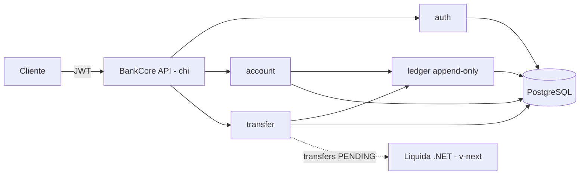
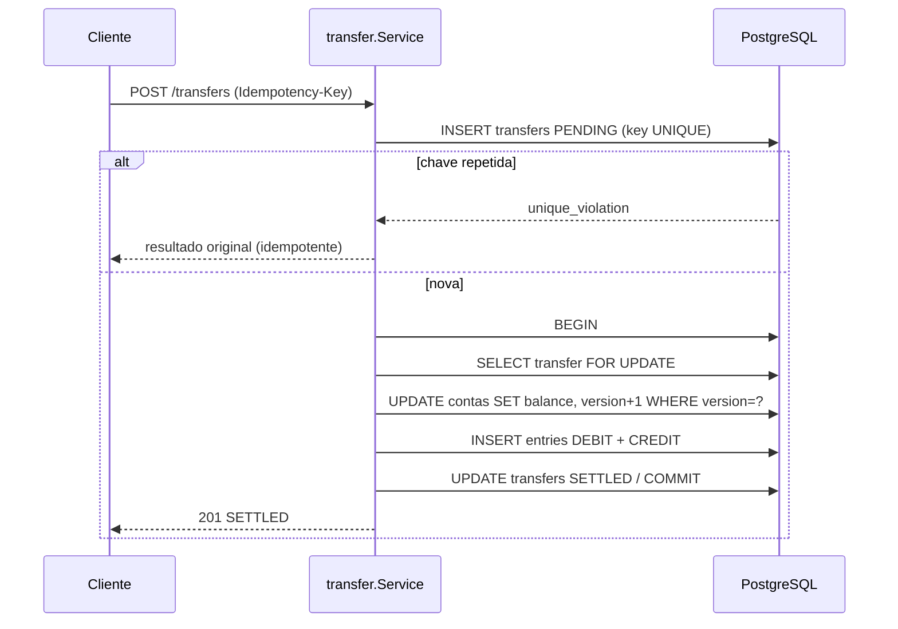

# BankCore

API de **núcleo bancário** em **Go**: contas, depósitos, saques e **transferências atômicas** entre contas, com extrato e **ledger append-only auditável**. Foco em consistência, concorrência e integridade monetária.

> Projeto-vitrine de backend em Go. Companheiro do [Liquida](../Liquida) (.NET + Angular), que **liquida** as transferências originadas aqui. Juntos formam um portfólio poliglota (Go + .NET + Angular) de sistemas bancários.

## Arquitetura (resumo)
- **Transferência atômica** dentro de uma transação de banco (pgx `tx`): débito + crédito + dois lançamentos, ou tudo ou nada.
- **Concorrência** com optimistic locking (coluna `version`) e retry em conflito. Ver ADR 0001.
- **Dinheiro** em centavos (`int64`), nunca `float64`. Ver ADR 0002.
- **Idempotência** de transferências via `Idempotency-Key`. Ver ADR 0003.
- **Ledger append-only**: saldo é projeção com invariante `saldo = soma(lançamentos)`.



Transferência atômica com optimistic lock e idempotência:



## Stack
Go 1.22+ · chi · pgx + PostgreSQL · golang-migrate · JWT · testcontainers-go · Docker · Makefile · GitHub Actions · Swagger (swaggo).

## Documentação (spec-driven)
- **Spec (versionada):** [`docs/specs/spec-v1.0.0.md`](docs/specs/spec-v1.0.0.md)
- **PRD:** [`docs/PRD_BankCore_Go.md`](docs/PRD_BankCore_Go.md)
- **ADRs:** [0001 optimistic locking](docs/adr/0001-optimistic-locking.md) · [0002 dinheiro int64](docs/adr/0002-dinheiro-int64-centavos.md) · [0003 idempotência](docs/adr/0003-idempotencia-transferencias.md)

## Como rodar
```bash
cp .env.example .env
make compose-up          # sobe o PostgreSQL
make migrate-up          # aplica as migrations (via docker migrate/migrate)
make run                 # sobe a API em :8080
```
Health check: `curl localhost:8080/health`.

## Endpoints
| Método | Rota | Auth |
|---|---|---|
| POST | `/auth/register` | pública |
| POST | `/auth/login` | pública |
| POST | `/auth/token` (client-credentials) | pública |
| POST | `/accounts` | cliente |
| GET | `/accounts/{id}` | dono/admin |
| POST | `/accounts/{id}/deposit` | dono/admin |
| POST | `/accounts/{id}/withdraw` | dono/admin |
| GET | `/accounts/{id}/statement?page=` | dono/admin |
| POST | `/transfers` (header `Idempotency-Key`) | dono/admin |
| GET | `/transfers?status=` | dono |
| GET | `/transfers/{id}` | participante/admin |
| GET | `/settlement/transfers?status=` | settlement |
| PATCH | `/transfers/{id}/settle` | settlement |
| PATCH | `/transfers/{id}/fail` | settlement |
| GET | `/admin/accounts` | admin |
| PATCH | `/admin/accounts/{id}/status` | admin |
| GET | `/admin/transfers?status=` | admin |
| POST | `/admin/service-clients` | admin |
| GET | `/health` | pública |
| GET | `/swagger/index.html` | pública |

Valores monetários entram/saem em decimal (`"100.50"`) e são operados internamente em centavos `int64`.

### Fronteira de liquidação com o Liquida (v1.1.0)
Com `LIQUIDA_INTEGRATION=external`, `POST /transfers` move o dinheiro atomicamente mas deixa a transferência `PENDING`; o Liquida autentica via client-credentials (`POST /auth/token` → JWT `SETTLEMENT` com TTL curto), lê o backlog em `GET /settlement/transfers?status=PENDING` (role SETTLEMENT, least-privilege, paginação offset `page`/`page_size` 50 + `has_next`) e confirma com `PATCH /transfers/{id}/settle` ou estorna com `/fail`. Padrão é `standalone` (auto-liquidante, = v1.0.0). Ver `docs/specs/spec-v1.1.0.md` e ADR 0004.

`docker compose up -d --build` sobe Postgres + migrations + API na rede `bankcore-net`, alcançável por outros serviços em `http://bankcore-api:8080` (host `:8081`). O Liquida anexa a mesma rede declarando-a `external`.

### Documentação interativa (Swagger)
A API expõe **Swagger UI** em `http://localhost:8080/swagger/index.html` e o spec em `/swagger/doc.json`, gerados via **swaggo** a partir das anotações nos handlers. Regenerar após alterar rotas:
```bash
swag init -g cmd/api/main.go -o internal/apidocs --parseDependency --parseInternal
```

## Exemplo
```bash
curl -X POST localhost:8080/auth/register -H 'Content-Type: application/json' \
  -d '{"name":"Alice","email":"alice@bankcore.dev","password":"secret123"}'
TOKEN=$(curl -s -X POST localhost:8080/auth/login -H 'Content-Type: application/json' \
  -d '{"email":"alice@bankcore.dev","password":"secret123"}' | jq -r .token)
curl -X POST localhost:8080/accounts -H "Authorization: Bearer $TOKEN"
```

## Testes
```bash
go test ./...            # sobe PostgreSQL real via testcontainers-go
```
Cobrem atomicidade (CA1), concorrência com optimistic lock (CA2), idempotência (CA3) e a fronteira de liquidação: POST external deixa PENDING (CA6), settle idempotente (CA7), fail com estorno append-only (CA8) e RBAC da role SETTLEMENT (CA9).

## Status
v1.0.0 completa. **v1.1.0 (fronteira de liquidação com o Liquida)** implementada: modo `standalone`/`external`, auth M2M via client-credentials (JWT `SETTLEMENT`, TTL curto), `PATCH /transfers/{id}/settle` e `/fail` com estorno append-only, `GET /transfers?status=PENDING`. Ver `docs/specs/spec-v1.1.0.md` e ADR 0004.
